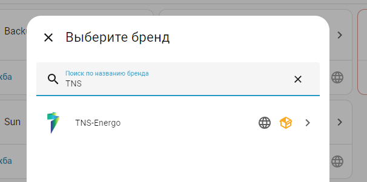
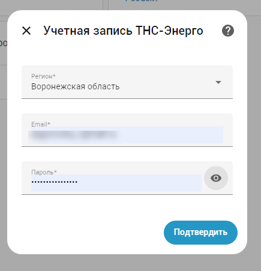
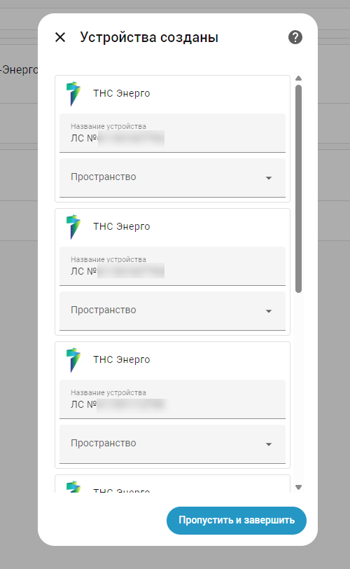
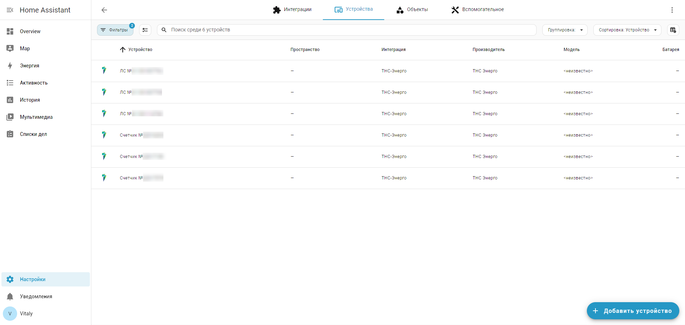
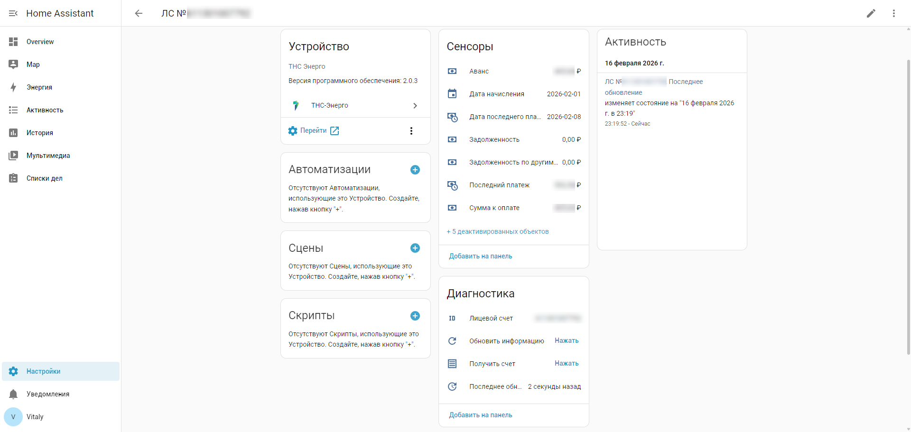
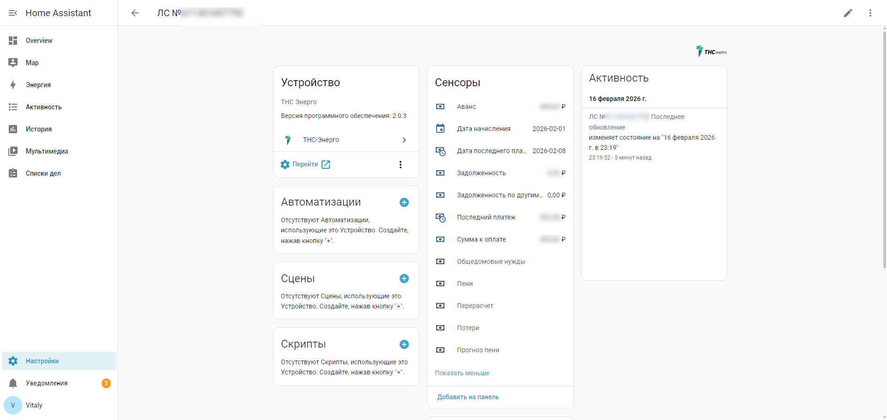
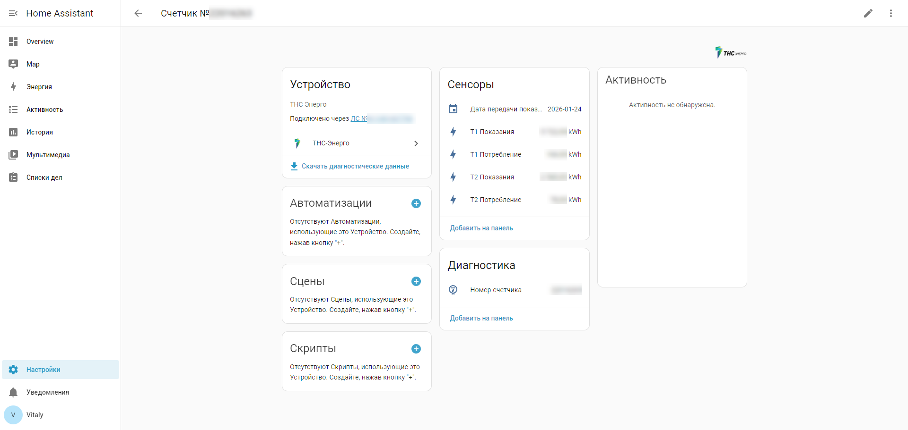
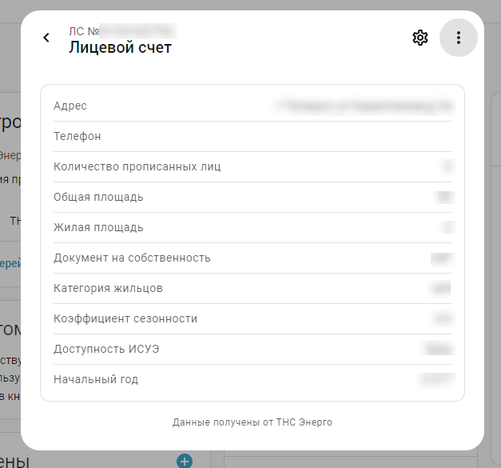
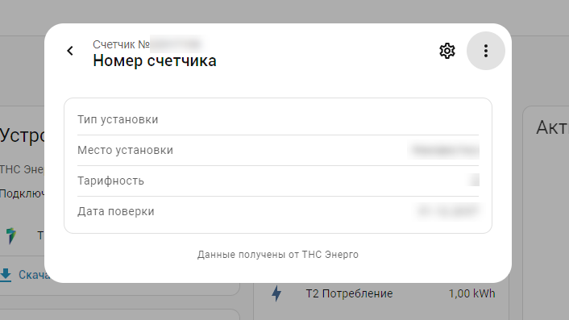
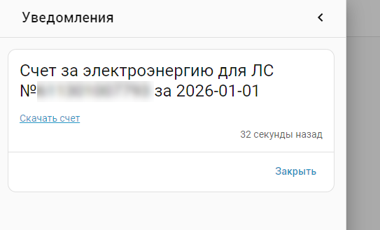

[](https://github.com/hacs/integration)


# TNS-Energo для Home Assistant

Интеграция [ТНС-Энерго](https://corp.tns-e.ru/onlayn-servisy/) для Home Assistant.
Позволяет получать данные о лицевых счетах, показаниях счетчиков, задолженности и начислениях,
а также отправлять показания и запрашивать счета через мобильный API ТНС-Энерго.

## Поддерживаемые регионы

Интеграция поддерживает все регионы, доступные в мобильном приложении ТНС-Энерго:

- Воронежская область
- Краснодарский край и Республика Адыгея (Кубань)
- Нижегородская область
- Ростовская область
- и другие регионы, доступные через API

Список регионов загружается автоматически из API при настройке интеграции.

## Установка

**Способ 1.** Через HACS:

[](https://my.home-assistant.io/redirect/hacs_repository/?owner=lizardsystems&repository=hass-tnse&category=integration)

Нажмите кнопку выше → Установить → Перезагрузить Home Assistant.

**Способ 2.** Вручную скопируйте папку `tns_energo`
из [последнего релиза](https://github.com/lizardsystems/hass-tnse/releases/latest) в
директорию `/config/custom_components`.

После установки перезагрузите Home Assistant.

## Настройка

[Настройки](https://my.home-assistant.io/redirect/config) → Устройства и службы
→ [Интеграции](https://my.home-assistant.io/redirect/integrations)
→ [Добавить интеграцию](https://my.home-assistant.io/redirect/config_flow_start?domain=tns_energo) → Поиск → **TNS-Energo**

или нажмите:

[](https://my.home-assistant.io/redirect/config_flow_start?domain=tns_energo)



При настройке укажите:

- **Регион** — выберите ваш регион из списка
- **Email** — адрес электронной почты учетной записи ТНС-Энерго
- **Пароль** — пароль от учетной записи



После успешной авторизации интеграция автоматически обнаружит все лицевые счета,
привязанные к вашей учетной записи, и создаст для каждого отдельное устройство.
Для каждого счетчика создается дочернее устройство, привязанное к лицевому счету.



### Параметры

В настройках интеграции (Настройки → Устройства и службы → TNS-Energo → Настроить)
доступен параметр:

- **Интервал обновления (минуты)** — как часто обновлять данные (по умолчанию: 60 минут)

### Переавторизация

Если учетные данные изменились, интеграция запросит переавторизацию.
Перейдите в настройки интеграции и нажмите «Переавторизовать».

### Перенастройка

Для изменения пароля или региона без удаления интеграции используйте
кнопку «Перенастроить» в настройках интеграции.

## Удаление

1. Перейдите в [Настройки](https://my.home-assistant.io/redirect/config) → Устройства и службы → [Интеграции](https://my.home-assistant.io/redirect/integrations)
2. Найдите **TNS-Energo** в списке
3. Нажмите на три точки (⋯) → **Удалить**

Все устройства и сенсоры интеграции будут удалены автоматически.
Никаких дополнительных действий не требуется.

Если интеграция была установлена через HACS, её также можно удалить из HACS.

## Обновление данных

Данные обновляются из API ТНС-Энерго методом опроса (polling).
Интервал обновления настраивается и по умолчанию составляет **60 минут**.

При каждом обновлении запрашиваются:
- Список лицевых счетов
- Информация по каждому лицевому счету
- Баланс и начисления
- Показания счетчиков

Для немедленного обновления данных используйте кнопку «Обновить» или действие `tns_energo.refresh`.

## Устройства

Все устройства интеграции отображаются на странице **Настройки → Устройства и службы → TNS-Energo → Устройства**.
Лицевые счета и счетчики представлены как отдельные устройства:



## Сенсоры

### Сенсоры лицевого счета

Для каждого лицевого счета создаются следующие сенсоры на устройстве «ЛС №...»:

| Сенсор | Описание | Категория |
|--------|----------|-----------|
| **Лицевой счет** (Account) | Номер лицевого счета | Диагностика |
| **Сумма к оплате** (Amount to be paid) | Начисленная сумма к оплате | — |
| **Дата начисления** (Billing date) | Дата закрытого расчетного месяца | — |
| **Задолженность** (Balance) | Сумма задолженности | — |
| **Последнее обновление** (Last update) | Время последнего обновления данных | Диагностика, отключен по умолчанию |



Дополнительные сенсоры отключены по умолчанию. Их можно включить на странице устройства:

| Сенсор | Описание |
|--------|----------|
| **Пени** (Penalty) | Начисленные пени |
| **Аванс** (Advance payment) | Авансовый платеж |
| **Перерасчет** (Recalculation) | Сумма перерасчета |
| **Общедомовые нужды** (Common house needs) | Начисления за ОДН |
| **Прогноз пени** (Penalty forecast) | Прогноз начисления пени |
| **Потери** (Losses) | Потери |
| **Задолженность по другим услугам** (Other services debt) | Задолженность по прочим услугам |
| **Последний платеж** (Last payment) | Сумма последнего платежа |
| **Дата последнего платежа** (Last payment date) | Дата последнего платежа |



### Сенсоры счетчика

Для каждого счетчика создается дочернее устройство «Счетчик №...», привязанное к лицевому счету.
На одном лицевом счете может быть несколько счетчиков — для каждого создается отдельное устройство.

| Сенсор | Описание | Категория |
|--------|----------|-----------|
| **Счетчик** (Meter) | Номер счетчика | Диагностика |
| **Дата передачи показаний** (Readings date) | Дата последней передачи показаний | Отключен по умолчанию |

В зависимости от тарифности счетчика (однотарифный, двухтарифный, трехтарифный)
на устройстве счетчика создаются сенсоры показаний и потребления:

| Тарифность | Показания | Потребление |
|------------|-----------|-------------|
| Однотарифный | **Показания** (Reading) | **Потребление** (Consumption) |
| Двухтарифный | **Т1 Показания**, **Т2 Показания** | **Т1 Потребление**, **Т2 Потребление** |
| Трехтарифный | **Т1 Показания**, **Т2 Показания**, **Т3 Показания** | **Т1 Потребление**, **Т2 Потребление**, **Т3 Потребление** |



### Атрибуты сенсоров

Сенсор **Лицевой счет** содержит дополнительные атрибуты:
- Адрес, телефон, количество прописанных лиц, общая площадь, жилая площадь,
  документ на собственность, категория жильцов, коэффициент сезонности,
  доступность ИСУЭ, начальный год



Сенсор **Сумма к оплате** содержит:
- Задолженность, задолженность пени, закрытый месяц, перерасчет,
  потери, ОДН, пени прогноз, аванс

Сенсор **Счетчик** содержит:
- Тип установки, место установки, тарифность, дата поверки



Сенсоры **Показания** содержат:
- Название тарифа, дата показаний

## Кнопки

Для каждого лицевого счета создаются кнопки:

| Кнопка | Описание |
|--------|----------|
| **Обновить информацию** (Refresh) | Немедленное обновление информации |
| **Получить счет** (Get bill) | Запрос счета за прошлый месяц |

## Действия (Actions)

Интеграция предоставляет три действия:

### tns_energo.refresh — Обновить информацию

Обновляет все данные лицевого счета через API.

Параметры:
- **device_id** — устройство (лицевой счет или счетчик)

```yaml
action: tns_energo.refresh
data:
  device_id: <YOUR_DEVICE_ID>
```

### tns_energo.send_readings — Отправить показания

Отправляет показания счетчика в ТНС-Энерго.

Параметры:
- **device_id** — устройство (счетчик)
- **t1** — сенсор со значением потребления T1, кВт⋅ч (обязательный)
- **t2** — сенсор со значением потребления T2, кВт⋅ч (необязательный)
- **t3** — сенсор со значением потребления T3, кВт⋅ч (необязательный)

Для однотарифных счетчиков укажите только `t1`.
Для двухтарифных — `t1` и `t2`, для трехтарифных — `t1`, `t2` и `t3`.

```yaml
action: tns_energo.send_readings
data:
  device_id: '{{device_id("Счетчик №10000001")}}'
  t1: sensor.neva_mt_114_wi_fi_22222222_energy_t1_a
  t2: sensor.neva_mt_114_wi_fi_22222222_energy_t2_a
```

### tns_energo.get_bill — Получить счет

Запрашивает счет об оказанных услугах и сохраняет PDF в `/config/www/tns_energo/`.

Параметры:
- **device_id** — устройство (лицевой счет или счетчик)
- **date** — дата (месяц) для получения счета (необязательный, по умолчанию — прошлый месяц)

```yaml
action: tns_energo.get_bill
data:
  device_id: <YOUR_DEVICE_ID>
```

С указанием даты:

```yaml
action: tns_energo.get_bill
data:
  device_id: <YOUR_DEVICE_ID>
  date: "2026-01-01"
```

Также можно вызывать действия с использованием имени устройства:

```yaml
action: tns_energo.get_bill
data:
  device_id: '{{device_id("ЛС №611000000000")}}'
```

## События

Интеграция генерирует следующие события:

| Событие | Описание |
|---------|----------|
| `tns_energo_refresh_completed` | Данные обновлены успешно |
| `tns_energo_get_bill_completed` | Счет получен успешно |
| `tns_energo_send_readings_completed` | Показания отправлены успешно |
| `tns_energo_refresh_failed` | Ошибка при обновлении данных |
| `tns_energo_get_bill_failed` | Ошибка при получении счета |
| `tns_energo_send_readings_failed` | Ошибка при отправке показаний |

Каждое событие содержит `device_id` в данных.

Дополнительные поля событий:
- `send_readings_completed` — `readings` (отправленные показания), `balance` (предварительный расчет)
- `get_bill_completed` — `date` (дата счета), `file_path` (путь к PDF на диске), `url` (URL для скачивания)
- Событие `*_failed` — `error` (текст ошибки)

## Автоматизации

Для отправки показаний и получения счета по расписанию можно создать автоматизации с использованием
описанных выше действий (actions), а также автоматизации для отправки уведомлений в Telegram
и веб-интерфейс Home Assistant.

### Вызов действий по расписанию

Для вызова действия по расписанию используется триггер Time с дополнительным условием на дату.

#### Отправка показаний в ТНС-Энерго

Показания отправляются 24 числа каждого месяца в 1:00.
Через минуту после отправки обновляются данные лицевого счета.

> **Примечание:** В `device_id` для `send_readings` указывается устройство **счетчика**
> (например, «Счетчик №10000001»). Для `refresh` и `get_bill` можно указать любое устройство
> интеграции (лицевой счет или счетчик).

```yaml
alias: Отправить показания по электроэнергии
description: ""
triggers:
  - trigger: time
    at: "01:00:00"
conditions:
  - condition: template
    value_template: "{{ now().day == 24 }}"
actions:
  - action: tns_energo.send_readings
    data:
      device_id: <YOUR_DEVICE_ID>  # ID устройства счетчика
      t1: sensor.neva_mt_114_wi_fi_22222222_energy_t1_a
      t2: sensor.neva_mt_114_wi_fi_22222222_energy_t2_a
    alias: "ТНС-Энерго: Отправить показания (Дом)"
  - delay:
      hours: 0
      minutes: 1
      seconds: 0
      milliseconds: 0
  - action: tns_energo.refresh
    data:
      device_id: <YOUR_DEVICE_ID>  # ID устройства лицевого счета
mode: single
```

Вы можете указать свою дату, скорректировав строку `"{{ now().day == 24 }}"`,
а также изменить время в строке `at: "01:00:00"`.

#### Получение счета от ТНС-Энерго

Счет запрашивается 5 числа каждого месяца в 1:00:

```yaml
alias: Запросить счет за электроэнергию
description: ""
triggers:
  - trigger: time
    at: "01:00:00"
conditions:
  - condition: template
    value_template: "{{ now().day == 5 }}"
actions:
  - action: tns_energo.get_bill
    data:
      device_id: <YOUR_DEVICE_ID>
mode: single
```

### Уведомления

Триггером для отправки уведомлений является соответствующее событие
`tns_energo_*_completed` или `tns_energo_*_failed`.

#### Уведомление об отправленных показаниях в Telegram и Home Assistant

> **Примечание:** Начиная с Home Assistant 2025.11, для отправки сообщений в Telegram используется
> действие `notify.send_message` с указанием `entity_id` вашего Telegram-бота
> (например, `notify.telegram_bot`). Замените `notify.telegram_bot` на ваш фактический entity_id.

```yaml
alias: Уведомление об отправленных показаниях
description: ""
triggers:
  - trigger: event
    event_type: tns_energo_send_readings_completed
conditions: []
actions:
  - action: notify.send_message
    target:
      entity_id: notify.telegram_bot
    data:
      title: >-
        Показания для
        {{device_attr(trigger.event.data.device_id, 'name_by_user') or
        device_attr(trigger.event.data.device_id, 'name')}}
        отправлены {{ now().strftime('%d.%m.%Y %H:%M')}}
      message: >-
        Показания: {{ trigger.event.data.readings | join(', ') }} кВт⋅ч
  - action: persistent_notification.create
    data:
      title: >-
        Показания для
        {{device_attr(trigger.event.data.device_id, 'name_by_user') or
        device_attr(trigger.event.data.device_id, 'name')}}
        отправлены {{ now().strftime('%d.%m.%Y %H:%M')}}
      message: >-
        Показания: {{ trigger.event.data.readings | join(', ') }} кВт⋅ч
mode: single
```

#### Уведомление о полученном счете

При получении счета PDF-файл автоматически сохраняется в `/config/www/tns_energo/` и становится
доступен по адресу `/local/tns_energo/`. В событии `tns_energo_get_bill_completed` содержатся поля
`file_path` (абсолютный путь к файлу на диске) и `url` (URL для скачивания через веб-интерфейс).



> **Важно:** Для отправки файлов через Telegram необходимо разрешить доступ к директории
> в `configuration.yaml`:
>
> ```yaml
> homeassistant:
>   allowlist_external_dirs:
>     - "/config/www/tns_energo"
> ```

**Вариант 1.** Отправка PDF через `telegram_bot.send_document`:

```yaml
alias: Уведомление о счете за электроэнергию
description: ""
triggers:
  - trigger: event
    event_type: tns_energo_get_bill_completed
conditions: []
actions:
  # отправка PDF в Telegram
  - action: telegram_bot.send_document
    data:
      file: "{{ trigger.event.data.file_path }}"
      caption: >-
        Счет за электроэнергию для
        {{device_attr(trigger.event.data.device_id, 'name_by_user') or
        device_attr(trigger.event.data.device_id, 'name')}}
        за {{ trigger.event.data.date }}
  # уведомление в веб-интерфейсе со ссылкой на скачивание
  - action: persistent_notification.create
    data:
      title: >-
        Счет за электроэнергию для
        {{device_attr(trigger.event.data.device_id, 'name_by_user') or
        device_attr(trigger.event.data.device_id, 'name')}}
        за {{ trigger.event.data.date }}
      message: >-
        <a href="{{ trigger.event.data.url }}" target="_blank">Скачать счет</a>
mode: single
```

**Вариант 2.** Отправка PDF через `notify.send_message` (entity-based):

```yaml
alias: Уведомление о счете за электроэнергию
description: ""
triggers:
  - trigger: event
    event_type: tns_energo_get_bill_completed
conditions: []
actions:
  # отправка PDF в Telegram через notify entity
  - action: notify.send_message
    target:
      entity_id: notify.telegram_bot
    data:
      message: >-
        Счет для
        {{device_attr(trigger.event.data.device_id, 'name_by_user') or
        device_attr(trigger.event.data.device_id, 'name')}}
        за {{ trigger.event.data.date }}
      data:
        document:
          file: "{{ trigger.event.data.file_path }}"
          caption: >-
            Счет за электроэнергию за {{ trigger.event.data.date }}
  # уведомление в веб-интерфейсе со ссылкой на скачивание
  - action: persistent_notification.create
    data:
      title: >-
        Счет за электроэнергию для
        {{device_attr(trigger.event.data.device_id, 'name_by_user') or
        device_attr(trigger.event.data.device_id, 'name')}}
        за {{ trigger.event.data.date }}
      message: >-
        <a href="{{ trigger.event.data.url }}" target="_blank">Скачать счет</a>
mode: single
```

> Замените `notify.telegram_bot` на ваш фактический entity_id.

#### Уведомления об ошибках в Telegram и Home Assistant

```yaml
alias: Уведомление об ошибке ТНС-Энерго
description: ""
triggers:
  - trigger: event
    event_type: tns_energo_send_readings_failed
  - trigger: event
    event_type: tns_energo_get_bill_failed
  - trigger: event
    event_type: tns_energo_refresh_failed
conditions: []
actions:
  - action: notify.send_message
    target:
      entity_id: notify.telegram_bot
    data:
      title: >-
        
        Ошибка при передаче показаний для
        
        Ошибка при получении счета для
        
        Ошибка при обновлении информации для
        
        Ошибка при выполнении действия для
        
        {{device_attr(trigger.event.data.device_id, 'name_by_user') or
        device_attr(trigger.event.data.device_id, 'name')}}
        от {{ now().strftime('%d.%m.%Y %H:%M')}}
      message: "{{ trigger.event.data.error }}"
  - action: persistent_notification.create
    data:
      title: >-
        
        Ошибка при передаче показаний для
        
        Ошибка при получении счета для
        
        Ошибка при обновлении информации для
        
        Ошибка при выполнении действия для
        
        {{device_attr(trigger.event.data.device_id, 'name_by_user') or
        device_attr(trigger.event.data.device_id, 'name')}}
        от {{ now().strftime('%d.%m.%Y %H:%M')}}
      message: "{{ trigger.event.data.error }}"
mode: single
```

### Получение счета с выбором даты через интерфейс

Интеграция поддерживает действие `tns_energo.get_bill`, которое принимает параметры `device_id` и `date`.
Для удобства можно создать пользовательский интерфейс с выбором даты и кнопкой вызова действия.

#### Настройка помощника (Helper)

Создайте помощник `input_datetime`, чтобы выбрать дату:

1. Откройте **Настройки → Устройства и службы → Помощники**
2. Нажмите **+ Создать помощник**
3. Выберите **Дата**
4. Укажите имя, например: `tns_energo_bill_date`

После этого будет создан объект `input_datetime.tns_energo_bill_date`.

#### Создание скрипта

Создайте скрипт `get_tns_energo_bill` (через UI или `scripts.yaml`),
который вызывает действие `tns_energo.get_bill` с параметрами:

```yaml
sequence:
  - action: tns_energo.get_bill
    data:
      device_id: <YOUR_DEVICE_ID>
      date: "{{ states('input_datetime.tns_energo_bill_date') }}"
```

> Замените `device_id` на ваш фактический ID устройства.

#### Добавление в интерфейс Lovelace

Добавьте следующую карточку в интерфейс Home Assistant (Lovelace UI):

```yaml
type: vertical-stack
cards:
  - type: entities
    entities:
      - entity: input_datetime.tns_energo_bill_date
  - type: button
    name: Получить счет
    icon: mdi:file-document
    tap_action:
      action: perform-action
      perform_action: script.get_tns_energo_bill
    show_name: false
    show_icon: true
    show_state: false
```

#### Использование

1. Выберите дату в календаре
2. Нажмите кнопку **Получить счет**
3. Действие `tns_energo.get_bill` будет вызвано с выбранной датой

> Подстановки вида `{{ states(...) }}` **не поддерживаются напрямую** в кнопках интерфейса Lovelace.
> Чтобы передавать параметры с шаблонами, используйте **скрипты**.

### Получение счета за текущий месяц

Если вы хотите, чтобы действие `tns_energo.get_bill` автоматически запрашивало счет за текущий месяц
без выбора даты вручную, создайте скрипт:

```yaml
sequence:
  - action: tns_energo.get_bill
    data:
      device_id: <YOUR_DEVICE_ID>
      date: "{{ now().date() }}"
```

Кнопка в Lovelace для запуска:

```yaml
type: button
name: Получить счет за текущий месяц
icon: mdi:calendar-today
tap_action:
  action: perform-action
  perform_action: script.get_tns_energo_bill_today
```

## Известные ограничения

- Интеграция использует мобильный API ТНС-Энерго, который не является публичным. Изменения в API могут привести к временной неработоспособности интеграции.
- Счет (PDF) автоматически сохраняется в `/config/www/tns_energo/`. Для отправки файла через Telegram необходимо добавить путь в `allowlist_external_dirs`.
- Интервал обновления по умолчанию — 60 минут. Слишком частые запросы могут привести к временной блокировке со стороны API.

## Устранение неполадок

Включите ведение журнала отладки, добавив следующее в `configuration.yaml`:

```yaml
logger:
  default: warning
  logs:
    custom_components.tns_energo: debug
    aiotnse: debug
```

После возникновения проблемы найдите записи в журнале (`/config/home-assistant.log`)
и создайте [запрос на исправление](https://github.com/lizardsystems/hass-tnse/issues).

### Частые проблемы

- **Ошибка авторизации**: Проверьте правильность email и пароля. Убедитесь, что аккаунт активен на сайте ТНС-Энерго.
- **Регион не найден**: Убедитесь, что выбран правильный регион для вашего лицевого счета.
- **Данные не обновляются**: Проверьте интернет-соединение. Попробуйте нажать кнопку «Обновить» или вызовите действие `tns_energo.refresh`.

## Диагностика

Интеграция поддерживает функцию диагностики Home Assistant.
Для загрузки диагностических данных перейдите в настройки интеграции и нажмите «Загрузить диагностику».
Конфиденциальные данные (email, пароль, имя, телефон) автоматически скрываются.

## Дополнительная информация

- Библиотека API: [aiotnse](https://github.com/lizardsystems/aiotnse)
- Сайт ТНС-Энерго: https://corp.tns-e.ru/onlayn-servisy/
- Проблемы и предложения: https://github.com/lizardsystems/hass-tnse/issues
