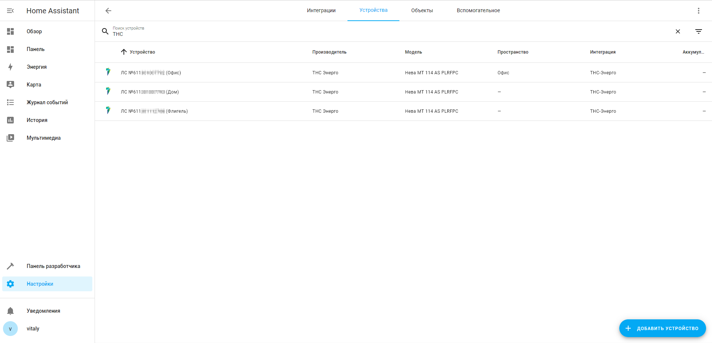
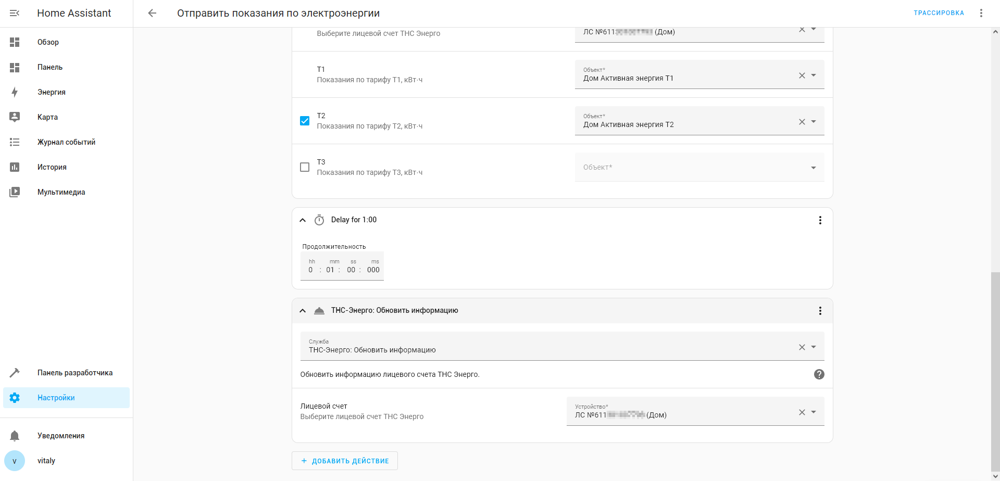
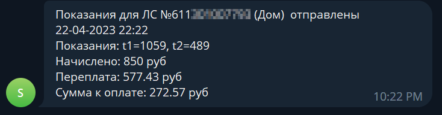

[](https://github.com/hacs/integration)


Этот репозиторий содержит настраиваемый компонент для Home Assistant для отображения данных из сервиса THC-Энерго.

# Установка

**Способ 1.** [](https://my.home-assistant.io/redirect/hacs_repository/?owner=lizardsystems&repository=hass-tnse&category=integration)
 &rarr; Установить

**Способ 2.** Вручную скопируйте папку `tns_energo`
из [latest release](https://github.com/lizardsystems/hass-tnse/releases/latest) в
директорию `/config/custom_components`.

После установки необходимо перегрузить Home Assistant

# Настройка

[Настройки](https://my.home-assistant.io/redirect/config) &rarr; Устройства и службы
&rarr; [Интеграции](https://my.home-assistant.io/redirect/integrations)
&rarr; [Добавить интеграцию](https://my.home-assistant.io/redirect/config_flow_start?domain=tns_energo) &rarr; Поиск &rarr; **TNS-Energo**

или нажмите:

[](https://my.home-assistant.io/redirect/config_flow_start?domain=tns_energo)


Появится окно настройки интеграции, укажите в нем лицевой счет в
сервисе [THC-Энерго](https://corp.tns-e.ru/onlayn-servisy/).


Если вы ввели лицевой счет правильно, то появится сообщение об успешном окончании настройки.


Вы можете подключить несколько лицевых счетов в интеграции.


Щелкнув на один из лицевых счетов, можно посмотреть устройства или объекты, созданные для этого лицевого счета.


Устройством будет каждый добавленный лицевой счет.



Объекты (сенсоры) для каждого лицевого счета


Общий вид устройства в Home Assistant.
В зависимости от тарифности лицевого счета (однтарифный, двухтарифный, трехтарифный)
будут добавлены сенсоры потребления электроэнергии с постфиксом T1,T2 и T3.


# Сенсоры

Создаются следующие объекты:

- Дата начисления
- Дата передачи показаний
- Закрытые показания T1, T2, T3 (в зависимости от тарифа)
    - Название тарифа
    - Номер тарифа
    - Название
- Предыдущие показания T1, T2, T3 (в зависимости от тарифа)
    - Название тарифа
    - Номер тарифа
    - Название
- Сумма к оплате
    - Входящее сальдо
    - Задолженность
    - Задолженность откл
    - Задолженность пени
    - Задолженность подкл
    - Закрытый месяц
    - Начислено по ИПУ
    - Перерасчет
    - Прогноз по ИПУ
    - Сумма потери
    - Сумма к оплате
    - Сумма одн прогноз
    - Сумма пени прогноз
    - Сумма платежей
    - Ф Начислено по ИПУ


- Лицевой счет
    - Адрес
    - Телефон
    - Количество прописанных лиц
    - Общая площадь
    - Жилая площадь
    - Документ на собственность
    - Место установки счетчика
    - Заводской номер счетчика
    - Категория жильцов
    - Коэффициент сезонности
    - Общий объем социальной нормы
    - Квитанция в электронном виде


- Счетчик
    - Расчетный счет
    - Модель
    - Тарифность счетчика
    - Разрядность
    - Коэффициент трансформации
    - Тип
    - Максимальные показания
    - Место установки
    - Год выпуска
    - Дата поверки
    - Дата последней поверки
    - Статус даты поверки


## Кнопки

- Кнопка для немедленного обновления информации
    - Вызывает сервис `tns_energo.refresh`, сервис обновления информации
- Кнопка для запроса счета за прошлый месяц
    - Вызывает сервис `tns_energo.get_bill`, сервис запроса счета за прошлый месяц


# Сервисы

Интеграция ТНС-Энерго публикует три сервиса:

- `tns_energo.get_bill` - сервис получения счета за прошлый месяц
- `tns_energo.refresh` - сервис обновления информации
- `tns_energo.send_readings` - сервис отправки показаний


## tns_energo.get_bill - ТНС-Энерго: Получить счет

Сервис позволяет запросить счет об оказанных услугах за прошлый месяц.


Параметры:

- **device_id** - Устройство Лицевой счет
- **date** - Дата (месяц) для получения счета (необязательный параметр)
  - Если не указана, то будет получен счет за прошлый месяц
  - Если указана, то необходимо указать первый день месяца, за который требуется получить счет

Вызов сервиса в формате yaml

```yaml
service: tns_energo.get_bill
data:
  device_id: c535106f017be8b830d448abd526a977
```
с указанием даты (месяца), на которую требуется получить счет

```yaml
service: tns_energo.get_bill
data:
  device_id: c535106f017be8b830d448abd526a977
  date: "2023-03-01"
```

Вызов сервиса с указанием даты счета позволяет получить счет за указанный месяц.
В этом случае необходимо указать первый день месяца, за который требуется получить счет.
В случае если дата не указана, то будет получен счет за прошлый месяц.


Можно сделать вызов сервиса с использованием имени устройства

```yaml
service: tns_energo.get_bill
data:
  device_id: '{{device_id("ЛC №611000000000 (Офис)")}}'
```

или с использованием одного из сенсоров этого устройства

```yaml
service: tns_energo.get_bill
data:
  device_id: '{{device_id("sensor.tns_energo_611000000000_account")}}'
```


После завершения выполнения сервиса генерируется событие **tns_energo_get_bill_completed**,
в случае ошибки генерируется событие **tns_energo_get_bill_failed**.

## tns_energo.refresh - ТНС-Энерго: Обновить информацию

Сервис запрашивает информацию через API и обновляет все сенсоры.


Параметры:
 - **device_id** - Устройство Лицевой счет

Вызов сервиса в формате yaml

```yaml
service: tns_energo.refresh
data:
  device_id: c535106f017be8b830d448abd526a977
```

Вызовы также могут быть выполнены с использованием имени устройства или имени одного из сенсоров.

После завершения выполнения сервиса генерируется событие **tns_energo_refresh_completed**,
в случае ошибки генерируется событие **tns_energo_refresh_failed**.

## tns_energo.send_readings - ТНС-Энерго: Отправить показания

Сервис отправляет показания в ТНС Энерго из указанных сенсоров.


Параметры:

- **device_id** - Устройство Лицевой счет
- **t1** - Показания по тарифу T1, кВт⋅ч (Обязательный) Сенсор со значением потребления
- **t2** - Показания по тарифу T2, кВт⋅ч (Необязательный) Сенсор со значением потребления
- **t3** - Показания по тарифу T3, кВт⋅ч (Необязательный) Сенсор со значением потребления

Для однотарифных счетчиков необходимо указать только t1.

Для двухтарифных счетчиков необходимо указать t1 и t2, для трехтарифных соответственно t1,t2 и t3

В случае неправильного указания параметров, например, для двухтарифного указан только T1, сервис вернет ошибку.

Вызов сервиса в формате yaml

```yaml
service: tns_energo.send_readings
data:
  device_id: '{{device_id("ЛC №611000000000 (Офис)")}}'
  t1: sensor.neva_mt_114_wi_fi_22222222_energy_t1_a
  t2: sensor.neva_mt_114_wi_fi_22222222_energy_t2_a

```

После завершения выполнения сервиса генерируется событие **tns_energo_send_readings_completed**,
в случае ошибки генерируется событие **tns_energo_send_readings_failed**.

# События

Интеграция генерирует следующие события:

- **tns_energo_refresh_completed** - сведения обновлены успешно
- **tns_energo_get_bill_completed** - счет получен успешно
- **tns_energo_send_readings_completed** - показания отправлены успешно
- **tns_energo_refresh_failed** - возникла ошибка при обновлении сведений
- **tns_energo_get_bill_failed** - возникла ошибка при получении счета
- **tns_energo_send_readings_failed** - возникла ошибка при отправке показаний

## Событие: tns_energo_refresh_completed - Информация обновлена

После выполнения службы обновления информации генерируется события **tns_energo_refresh_completed**, со следующими
свойствами:

```yaml
event_type: tns_energo_refresh_completed
data:
  device_id: c535106f017be8b830d448abd526a977
origin: LOCAL
time_fired: "2023-04-21T17:18:09.428522+00:00"
context:
  id: 01GYJD548GAG83ZEDVGVCF1WKR
  parent_id: null
  user_id: 386a6cba68ca41a0923d3b94b2710bdc


```

## Событие: tns_energo_get_bill_completed - Счет получен

После успешного выполнения службы получения счета генерируется события **tns_energo_get_bill_completed**, со следующими
свойствами:

```yaml
event_type: tns_energo_get_bill_completed
data:
  device_id: c535106f017be8b830d448abd526a977
  date: "2023-03-01"
  url: https://lk.rostov.tns-e.ru/temp/20230421202104_611000000000.pdf
origin: LOCAL
time_fired: "2023-04-21T17:21:04.522054+00:00"
context:
  id: 01GYJDAV1YHYZV63JH1Q1RGYMK
  parent_id: null
  user_id: 386a6cba68ca41a0923d3b94b2710bdc

```
 
## Событие: tns_energo_send_readings_completed - Показания отправлены

После успешного выполнения службы отправки показаний генерируется события **tns_energo_send_readings_completed**, со следующими
свойствами:

```yaml
event_type: tns_energo_send_readings_completed
data:
  device_id: 0c783f4eaaf44085fe302973c54dd4d4
  readings:
    t1: 1056
    t2: 488
  balance:
    ВХСАЛЬДО: "52.57"
    ЗАДОЛЖЕННОСТЬ: "-577.43"
    ЗАДОЛЖЕННОСТЬОТКЛ: "0.00"
    ЗАДОЛЖЕННОСТЬПЕНИ: "0"
    ЗАДОЛЖЕННОСТЬПОДКЛ: "0.00"
    ЗАКРЫТЫЙМЕСЯЦ: 01.04.23
    НАЧИСЛЕНОПОИПУ: "830.49"
    ПЕРЕРАСЧЕТ: "0"
    ПРОГНОЗПОИПУ: "0"
    СУМАПОТЕРИ: "0"
    СУММАКОПЛАТЕ: "253.06"
    СУММАОДНПРОГНОЗ: "0"
    СУММАПЕНИПРОГНОЗ: "0"
    СУММАПЛАТЕЖЕЙ: "630"
    СУММАПРОГНОЗНАЧ: "0.00"
    ФНАЧИСЛЕНОПОИПУ: "1"
    KOPLATEPSEVDO: "253.06"
origin: LOCAL
time_fired: "2023-04-21T17:24:11.379545+00:00"
context:
  id: 01GYJDGDDY8H99X6VFVEQ19WNK
  parent_id: null
  user_id: 386a6cba68ca41a0923d3b94b2710bdc

```
 - `readings` - переданные показания.
 - `balance` - предварительный расчет по переданным показаниям. 

## Событие: tns_energo_*_failed - Запрос к сервису выполнился с ошибкой

В случае выполнения сервиса с ошибкой интеграция генерирует следующие события:

- **tns_energo_refresh_failed** - возникла ошибка при обновлении сведений
- **tns_energo_get_bill_failed** - возникла ошибка при получении счета
- **tns_energo_send_readings_failed** - возникла ошибка при отправке показаний

Ниже пример такого события  

```yaml
event_type: tns_energo_refresh_failed
data:
  device_id: c535106f017be8b830d448abd526a977
  error: "Error description"
origin: LOCAL
time_fired: "2023-04-21T17:18:09.428522+00:00"
context:
  id: 01GYJD548GAG83ZEDVGVCF1WKR
  parent_id: null
  user_id: 386a6cba68ca41a0923d3b94b2710bdc
```

# Автоматизации

Для отправки показаний и получения счета по расписанию можно создать автоматизации с использованием описанных выше служб, а 
также автоматизации для отправки уведомлений в Телеграм, и веб интерфейс Home Assistant.


## Вызов сервисов по расписанию

Для вызова сервиса по расписанию используется платформа Time с дополнительным условием на дату.

### Отправка показаний в ТНС-Энерго

Показания будут отправляться 24 числа каждого месяца в 1 час ночи, через минуту после отправки показаний
будут обновляться сведения лицевого счета.




Автоматизация в формате yaml

```yaml
alias: Отправить показания по электроэнергии
description: ""
trigger:
  - platform: time
    at: "01:00:00"
condition:
  - condition: template
    value_template: "{{ now().day == 24 }}"
action:
  - service: tns_energo.send_readings
    data:
      device_id: 0c783f4eaaf44085fe302973c54dd4d4
      t1: sensor.neva_mt_114_wi_fi_22222222_energy_t1_a
      t2: sensor.neva_mt_114_wi_fi_22222222_energy_t2_a
    alias: "ТНС-Энерго: Отправить показания (Дом)"
  - delay:
      hours: 0
      minutes: 1
      seconds: 0
      milliseconds: 0
  - service: tns_energo.refresh
    data:
      device_id: 0c783f4eaaf44085fe302973c54dd4d4
mode: single
```

Вы можете указать свою дату для этого скорректируйте строку `"{{ now().day == 24 }}"`, 
а также можно изменить время для этого в строке `at: "01:00:00"` укажите нужное время.

### Получение счета от ТНС-Энерго

Счет будет запрашиваться 5 числа каждого месяца в 1 час ночи.


Автоматизация в формате yaml

```yaml
alias: Запросить счета за электроэнергию
description: ""
trigger:
  - platform: time
    at: "01:00:00"
condition:
  - condition: template
    value_template: "{{ now().day == 5 }}"
action:
  - service: tns_energo.get_bill
    data:
      device_id: c535106f017be8b830d448abd526a977
mode: single
```
Вы можете указать свою дату для этого скорректируйте строку `"{{ now().day == 5 }}"`, 
а также можно изменить время для этого в строке `at: "01:00:00"` укажите нужное время.

## Уведомления

Тригером для отправки уведомлений является соответсвующее событие **tns_energo_*_completed**.

### Уведомление об отправленных показаниях в Телеграм и веб интерфейс Home Assistant

Автоматизация в формате yaml

```yaml
alias: Уведомление об отправленных показаниях
description: ""
trigger:
  - platform: event
    event_type: tns_energo_send_readings_completed
condition: []
action:
  - service: telegram_bot.send_message
    data:
      authentication: digest
      parse_mode: markdown
      title: >-
        Показания для {{device_attr(trigger.event.data.device_id,
        'name_by_user') or  device_attr(trigger.event.data.device_id, 'name')
        }}  отправлены {{ now().strftime('%d-%m-%Y %H:%M')}}
      message: >-
        Показания: {{k}}={{v}},  

        Начислено: {{ trigger.event.data.balance['НАЧИСЛЕНОПОИПУ'] }} руб

        {{ 'Переплата' if trigger.event.data.balance['ЗАДОЛЖЕННОСТЬ']|float <0  
        else 'Задолженность' }}: {{
        trigger.event.data.balance['ЗАДОЛЖЕННОСТЬ']|float|abs }} руб 

        {{ 'Сумма к оплате' if trigger.event.data.balance['СУММАКОПЛАТЕ']|float
        >0   else 'Олата не требуется. Остаток на счете' }}: {{
        trigger.event.data.balance['СУММАКОПЛАТЕ']|float|abs }} руб
  - service: notify.persistent_notification
    data:
      title: >-
        Показания для {{device_attr(trigger.event.data.device_id,
        'name_by_user') or  device_attr(trigger.event.data.device_id, 'name') }}
        отправлены {{ now().strftime("%d-%m-%Y %H:%M")}}
      message: >-
        Показания: {{k}}={{v}},  

        Начислено: {{ trigger.event.data.balance['НАЧИСЛЕНОПОИПУ'] }} руб

        {{ 'Переплата' if trigger.event.data.balance['ЗАДОЛЖЕННОСТЬ']|float <0  
        else 'Задолженность' }}: {{
        trigger.event.data.balance['ЗАДОЛЖЕННОСТЬ']|float|abs }} руб 

        {{ 'Сумма к оплате' if trigger.event.data.balance['СУММАКОПЛАТЕ']|float
        >0   else 'Олата не требуется. Остаток на счете' }}: {{
        trigger.event.data.balance['СУММАКОПЛАТЕ']|float|abs }} руб
mode: single


```

Результат выполнения - сообщение в Телеграм



Результат выполнения - уведомление в Home Assistant


### Уведомления о счете за электроэнергию

Автоматизация в формате yaml

```yaml
alias: Уведомление о счете за электроэнергию
description: ""
trigger:
  - platform: event
    event_type: tns_energo_get_bill_completed
condition: [ ]
action:
  # уведомление в Телеграм
  - service: telegram_bot.send_document
    data:
      authentication: digest
      parse_mode: markdown
      url: >-
        {{trigger.event.data.url}}
      caption: >-
        Счет за электроэнергию для
        {{device_attr(trigger.event.data.device_id, 'name_by_user') or 
        device_attr(trigger.event.data.device_id, 'name') }}
        за {{trigger.event.data.date}}
  # уведомление в веб-интерфейсе  
  - service: notify.persistent_notification
    data:
      message: >-
        Скачать счет для 
        [{{device_attr(trigger.event.data.device_id, 'name_by_user') or 
        device_attr(trigger.event.data.device_id, 'name') }}]({{trigger.event.data.url}})
        за {{trigger.event.data.date}}.

      title: >-
        Счет за электроэнергию для
        {{device_attr(trigger.event.data.device_id, 'name_by_user') or 
        device_attr(trigger.event.data.device_id, 'name') }}
        за {{trigger.event.data.date}}

mode: single

```

Результат выполнения - сообщение в Телеграм


При отправке оповещения в телеграм передается не временная ссылка на сгенерированный счет, а сам счет.

Результат выполнения - уведомление в Home Assistant


**Внимание** ссылка для скачивания счета доступна несколько минут после генерации.
Для сохранения счета можно воспользоваться интеграцией
downloader (https://www.home-assistant.io/integrations/downloader/)

Добавив к автоматизации еще один шаг скачивания счета.

```yaml
- service: downloader.download_file
  data:
    url: "{{trigger.event.data.url}}"
    subdir: "bills"
```

### Уведомления об ошибках, возникших в процессе выполнения сервиса

Уведомления об ошибках, возникших в процессе выполнения, в Телеграм и веб интерфейс Home Assistant.

```yaml
alias: Уведомление об ошибке при выполнения сервиса
description: ""
trigger:
  - platform: event
    event_type: tns_energo_send_readings_failed
  - platform: event
    event_type: tns_energo_get_bill_failed
  - platform: event
    event_type: tns_energo_refresh_failed
condition: [ ]
action:
  # уведомление в Телеграм
  - service: telegram_bot.send_message
    data:
      authentication: digest
      parse_mode: markdown
      title: >-
        
        Ошибка при передаче показаний для
        
        Ошибка при получении счета для
        
        Ошибка при обновлении информации для
        
        Ошибка при выполнении сервиса для
        
        {{device_attr(trigger.event.data.device_id, 'name_by_user') or 
        device_attr(trigger.event.data.device_id, 'name') }}
        от {{ now().strftime('%d-%m-%Y %H:%M')}}
      message: "{{ trigger.event.data.error }}"
  # уведомление в веб-интерфейсе
  - service: notify.persistent_notification
    data:
      title: >-
        
        Ошибка при передаче показаний для
        
        Ошибка при получении счета для
        
        Ошибка при обновлении информации для
        
        Ошибка при выполнении сервиса для
        
        {{device_attr(trigger.event.data.device_id, 'name_by_user') or 
        device_attr(trigger.event.data.device_id, 'name') }} 
        от {{ now().strftime('%d-%m-%Y %H:%M')}}
      message: "{{ trigger.event.data.error }}"

mode: single
```
## Получение счёта с выбором даты через интерфейс

Интеграция `tns_energo` поддерживает сервис `tns_energo.get_bill`, который принимает параметры `device_id` и `date`. 
Для удобства можно создать пользовательский интерфейс с выбором даты и кнопкой вызова сервиса.

### Настройка помощника (Helper)

Создайте помощник `input_datetime`, чтобы выбрать дату:

1. Откройте **Settings → Devices & Services → Helpers**
2. Нажмите **+ Create Helper**
3. Выберите **Date**
4. Укажите имя, например: `tns_energo_bill_date`

После этого будет создан объект `input_datetime.tns_energo_bill_date`.

### Создание скрипта

Создайте скрипт `get_tns_energo_bill` (через UI или `scripts.yaml`), который вызывает сервис `tns_energo.get_bill` с параметрами:

```yaml
sequence:
  - service: tns_energo.get_bill
    data:
      device_id: c535106f017be8b830d448abd526a977
      date: "{{ states('input_datetime.tns_energo_bill_date') }}"
```

> Замените `device_id` на ваш фактический ID устройства.


### Добавление в интерфейс Lovelace

Добавьте следующую карточку в интерфейс Home Assistant (Lovelace UI):

```yaml
type: vertical-stack
cards:
  - type: entities
    entities:
      - entity: input_datetime.tns_energo_bill_date
  - type: button
    name: Получить счёт
    icon: mdi:file-document
    tap_action:
      action: call-service
      service: script.get_tns_energo_bill
    show_name: false
    show_icon: true
    show_state: false
```

### Использование

1. Выберите дату в календаре
2. Нажмите кнопку **Получить счёт**
3. Сервис `tns_energo.get_bill` будет вызван с выбранной датой


### Примечание

Подстановки вида `{{ states(...) }}` **не поддерживаются напрямую** в кнопках интерфейса Lovelace. Чтобы передавать параметры с шаблонами, используйте **скрипты**.

## Получение счёта за газ на сегодня

Если вы хотите, чтобы сервис `tns_energo.get_bill` автоматически запрашивал счёт за сегодня, без выбора даты вручную, 
вы можете создать скрипт или автоматизацию, которая будет передавать текущую дату в формате YYYY-MM-DD.

### Скрипт

Создайте следующий скрипт get_tns_energo_bill_today:

```yaml
sequence:
  - service: tns_energo.get_bill
    data:
      device_id: c535106f017be8b830d448abd526a977
      date: "{{ now().date() }}"
```

> {{ now().date() }} возвращает текущую дату в формате YYYY-MM-DD.

### Кнопка в интерфейсе Lovelace

Добавьте кнопку в интерфейс для запуска:

```yaml
type: button
name: Получить счёт за сегодня
icon: mdi:calendar-today
tap_action:
  action: call-service
  service: script.get_tns_energo_bill_today
```

## Возникли проблемы?

Включите ведение журнала отладки, поместив следующие инструкции в файл configuration.yaml:

```yaml
logger:
  default: warning
  logs:
    custom_components.tns_energo: debug
    aiotnse: debug

```

После возникновения проблемы, пожалуйста, найдите проблему в журнале (/config/home-assistant.log) и
создайте [запрос на исправление](https://github.com/lizardsystems/hass-tnse/issues).

# Дополнительная информация

Эта интеграция использует API https://corp.tns-e.ru/onlayn-servisy/.
