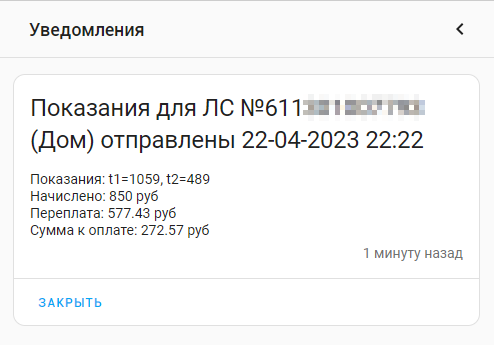
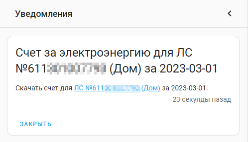
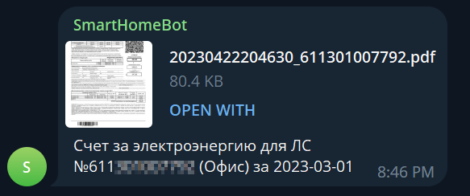

[](https://github.com/hacs/integration)


Этот репозиторий содержит настраиваемый компонент для Home Assistant для отображения данных из сервиса THC-Энерго.

## Установка

**Способ 1.** Через [HACS](https://hacs.xyz/) > Интеграции > Добавить пользовательский
репозиторий > https://github.com/lizardsystems/hass-tnse/ > **TNS-Energo** > Установить

**Способ 2.** Вручную скопируйте папку `tns_energo`
из [latest release](https://github.com/lizardsystems/hass-tnse/releases/latest) в
директорию `/config/custom_components`.

После установки необходимо перегрузить Home Assistant

## Настройка

> [Настройки](https://my.home-assistant.io/redirect/config) > Устройства и службы > [Интеграции](https://my.home-assistant.io/redirect/integrations) > [Добавить интеграцию](https://my.home-assistant.io/redirect/config_flow_start?domain=tns_energo) >
> Поиск **TNS-Energo**

или нажмите:

[](https://my.home-assistant.io/redirect/config_flow_start?domain=tns_energo)


Появится окно настройки интеграции, укажите в нем лицевой счет в сервисе [THC-Энерго](https://corp.tns-e.ru/onlayn-servisy/).


Если вы ввели лицевой счет правильно, то появится сообщение об успешном окончании настройки.


Вы можете подключить несколько лицевых счетов в интеграции.


Щелкнув на один из лицевых счетов можно посмотреть устройства или объекты созданные для этого лицевого счета.


Устройством будет каждый добавленный лицевой счет.


Объекты (сенсоры) для каждого лицевого счета


Общий вид устройства в Home Assistant. 
В зависимости от тарифности лицевого счета (однтарифный, двухтарифный, трехтарифный) 
будут добавлены сенсоры потребления электроэнергии с постфиксом T1,T2 и T3. 


## Сенсоры

Создаются следующие объекты:

- Дата начисления
- Дата передачи показаний
- Закрытые показания T1, T2, T3 (в зависимости от тарифа)
    - Название тарифа
    - Номер тарифа
    - Название
- Предыдущие показания T1, T2, T3 (в зависимости от тарифа)
    - Название тарифа
    - Номер тарифа
    - Название
- Сумма к оплате
    - Входящее сальдо
    - Задолженность
    - Задолженность откл
    - Задолженность пени
    - Задолженность подкл
    - Закрытый месяц
    - Начислено по ИПУ
    - Перерасчет
    - Прогноз по ИПУ
    - Сумма потери
    - Сумма к оплате
    - Сумма одн прогноз
    - Сумма пени прогноз
    - Сумма платежей
    - Ф Начислено по ИПУ


- Лицевой счет
    - Адрес
    - Телефон
    - Количество прописанных лиц
    - Общая площадь
    - Жилая площадь
    - Документ на собственность
    - Место установки счетчика
    - Заводской номер счетчика
    - Категория жильцов
    - Коэффициент сезонности
    - Общий объем социальной нормы
    - Квитанция в электронном виде


- Счетчик
    - Расчетный счет
    - Модель
    - Тарифность счетчика
    - Разрядность
    - Коэффициент трансформации
    - Тип
    - Максимальные показания
    - Место установки
    - Год выпуска
    - Дата поверки
    - Дата последней поверки
    - Статус даты поверки


### Кнопки

- Кнопка для немедленного обновления информации
- Кнопка для запроса счета за прошлый месяц


### Сервисы

Также интеграция публикует три сервиса

- Получить счет `tns_energo.get_bill`
- Обновить информацию `tns_energo.refresh`
- Отправить показания `tns_energo.send_readings`


#### Сервис: Получить счет

Сервис позволяет запросить счет об оказанных услугах за прошлый месяц.


Параметры: 
 - device_id - Устройство Лицевой счет  

Вызов сервиса в формате yaml

```yaml
service: tns_energo.get_bill
data:
  device_id: c535106f017be8b830d448abd526a977
```
или с использованием имени устройства

```yaml
service: tns_energo.get_bill
data:
  device_id: '{{device_id("ЛC №611000000000 (Офис)")}}'
```
или с использованием сенсора этого устройства

```yaml
service: tns_energo.get_bill
data:
  device_id: '{{device_id("sensor.tns_energo_611000000000_account")}}'
```

После выполнения сервиса создается уведомление в интерфейсе Home Assistant  


После нажатия ссылки начнется скачивания pdf файла со счетом для указанного лицевого счета.

#### Сервис: Обновить информацию

Сервис запрашивает информацию через API и обновляет состояние всех сенсоров.


Параметры: 
 - device_id - Устройство Лицевой счет  

Вызов сервиса в формате yaml

```yaml
service: tns_energo.refresh
data:
  device_id: c535106f017be8b830d448abd526a977
```

После выполнения работы службы вся информация в устройстве будет обновлена.

#### Сервис: Отправить показания

Сервис отправляет показания в ТНС Энерго из указанных источников данных.


Параметры: 
 
 - device_id - Устройство Лицевой счет  	
 - t1 - Показания по тарифу T1, кВт⋅ч (Обязательный) Сенсор со значением потребления 	
 - t2 - Показания по тарифу T2, кВт⋅ч (Необязательный) Сенсор со значением потребления  	
 - t3 - Показания по тарифу T3, кВт⋅ч (Необязательный) Сенсор со значением потребления

Для однотарифных счетчиков необходимо указать только T1. 

Для двухтарифных счетчиков необходимо указать T1 и T2, для трехтарифных соответственно T1,T2 и T3

В случае неправильного указания параметров, например, для двухтарифного указан только T1, сервис вернет ошибку.

Вызов сервиса в формате yaml

```yaml
service: tns_energo.send_readings
data:
  device_id: c535106f017be8b830d448abd526a977
  t1: sensor.neva_mt_114_wi_fi_22222222_energy_t1_a
  t2: sensor.neva_mt_114_wi_fi_22222222_energy_t2_a

```

После выполнения сервиса придет уведомление в интерфейсе Home Assistant с переданными сведениями и все сенсоры устройства будут обновлены.


### События
#### Событие: Информация обновлена

После выполнения службы обновления информации генерируется события **tns_energo_refresh**, со следующими свойствами:

```yaml
event_type: tns_energo_refresh
data:
  account: "611000000000"
  friendly_name: ЛC №611000000000 (Офис)
  title: Информация для "ЛC №611000000000 (Офис)" обновлена
  message: Информация для "ЛC №611000000000 (Офис)" обновлена 18-04-2023 21:32
  error: false
origin: LOCAL
time_fired: "2023-04-18T18:32:32.878414+00:00"
context:
  id: 01GYAT79DJFA8J81WH1CE7GARE
  parent_id: null
  user_id: 386a6cba68ca41a0923d3b94b2710bdc

```
#### Событие: Счет получен

После выполнения службы получения счета генерируется события **tns_energo_get_bill**, со следующими свойствами:

```yaml
event_type: tns_energo_get_bill
data:
  account: "611000000000"
  friendly_name: ЛC №611000000000 (Офис)
  url: https://lk.rostov.tns-e.ru/temp/20230418222502_611000000000.pdf
  title: Счет для "ЛC №611000000000 (Офис)" за 03-2023
  message: >-
    [Скачать счет для "ЛC №611000000000
    (Офис)"](https://lk.rostov.tns-e.ru/temp/20230418222502_611000000000.pdf) за
    03-2023
  error: false
origin: LOCAL
time_fired: "2023-04-18T19:25:02.244026+00:00"
context:
  id: 01GYAX7N6FRGYBES5HT483WMWX
  parent_id: null
  user_id: 386a6cba68ca41a0923d3b94b2710bdc

```

#### Событие: Показания отправлены

После выполнения службы отправки показаний генерируется события **tns_energo_send_readings**, со следующими свойствами:

```yaml
event_type: tns_energo_send_readings
data:
  account: "611000000000"
  friendly_name: ЛC №611000000000 (Офис)
  t1: 1049
  t2: 483
  ВХСАЛЬДО: "52.57"
  ЗАДОЛЖЕННОСТЬ: "-577.43"
  ЗАДОЛЖЕННОСТЬОТКЛ: "0.00"
  ЗАДОЛЖЕННОСТЬПЕНИ: "0"
  ЗАДОЛЖЕННОСТЬПОДКЛ: "0.00"
  ЗАКРЫТЫЙМЕСЯЦ: 01.04.23
  НАЧИСЛЕНОПОИПУ: "777.26"
  ПЕРЕРАСЧЕТ: "0"
  ПРОГНОЗПОИПУ: "0"
  СУМАПОТЕРИ: "0"
  СУММАКОПЛАТЕ: "199.83"
  СУММАОДНПРОГНОЗ: "0"
  СУММАПЕНИПРОГНОЗ: "0"
  СУММАПЛАТЕЖЕЙ: "630"
  СУММАПРОГНОЗНАЧ: "0.00"
  ФНАЧИСЛЕНОПОИПУ: "1"
  KOPLATEPSEVDO: "199.83"
  title: Показания для "ЛC №611000000000 (Офис)" отправлены 18-04-2023 23:41
  message: >-
    Переданы показания "ЛC №611000000000 (Офис)":  t1=1049, t2=483. Начислено:
    777.26 руб, Переплата: 577.43 руб, Сумма к оплате: 199.83 руб,
  error: false
origin: LOCAL
time_fired: "2023-04-18T20:41:09.427423+00:00"
context:
  id: 01GYB1JX9XPF1188M9HSK5TH7M
  parent_id: 01GYB1JX9X6N43WJVR0ESXFH58
  user_id: null

```

## Автоматизации

Для отправки показаний и получения счета по расписанию созданы автоматизации с использованием описанных выше служб.
Также созданы автоматизации для отправки уведомлений в Телеграм.


### Вызов сервисов по расписанию

Для вызова сервиса по расписанию используется платформа Time с дополнительным условием на дату.

#### Отправка показаний в ТНС-Энерго

Показания отправляются 24 числа каждого месяца в 1 час ночи. 


Автоматизация в формате yaml

```yaml
alias: Отправить показания по электроэнергии
description: ""
trigger:
  - platform: time
    at: "01:00:00"
condition:
  - condition: template
    value_template: 
action:
  - service: tns_energo.send_readings
    data:
      device_id: c535106f017be8b830d448abd526a977
      t1: sensor.neva_mt_114_wi_fi_22222222_energy_t1_a
      t2: sensor.neva_mt_114_wi_fi_22222222_energy_t2_a
    alias: "ТНС-Энерго: Отправить показания (Офис)"
mode: single
```
в строке `"{{ now().day == 24 }}"` вы можете указать свою дату и свое время в строке `at: "01:00:00"`

#### Получение счета от ТНС-Энерго

Счет запрашивается 5 числа каждого месяца в 1 час ночи.


Автоматизация в формате yaml

```yaml
alias: Запросить счета за электроэнергию
description: ""
trigger:
  - platform: time
    at: "01:00:00"
condition:
  - condition: template
    value_template: "{{ now().day == 5 }}"
action:
  - service: tns_energo.get_bill
    data:
      device_id: c535106f017be8b830d448abd526a977
mode: single
```

в строке `"{{ now().day == 5 }}"` вы можете указать свою дату и свое время в строке `at: "01:00:00"`

### Уведомления

Тригером для отправки уведомлений в Телеграм является соответсвующее событие, 
данные для сообщений передаются в самом событии в тегах message и title.

Также вы можете самостоятельно сформировать сообщение из других данных предоставленных в теле события.

#### Уведомления о переданных сведениях в Телеграм



Автоматизация в формате yaml

```yaml
alias: Оповестить о переданных сведениях по электроэнергии в Телеграмм
description: ""
trigger:
  - platform: event
    event_type: tns_energo_send_readings
condition: []
action:
  - service: telegram_bot.send_message
    data:
      message: "{{trigger.event.data.message}}"
      title: "{{trigger.event.data.title}}"
mode: single

```
Результат выполнения - сообщение в Телеграм


#### Уведомления о счете за электроэнергию в Телеграм




Дополнительно к тегам message и title, используется тег url, в котором хранится ссылка на документ

Также вы можете самостоятельно сформировать сообщение из других данных предоставленных в теле события.

Автоматизация в формате yaml

```yaml
alias: Оповестить о счете за электроэнергию в Телеграм
description: ""
trigger:
  - platform: event
    event_type: tns_energo_get_bill
condition: []
action:
  - service: telegram_bot.send_message
    data:
      message: "{{trigger.event.data.message}}"
      title: "{{trigger.event.data.title}}"
  - service: telegram_bot.send_document
    data:
      authentication: digest
      url: "{{trigger.event.data.url}}"
mode: single

```
Результат выполнения - сообщение в Телеграм 



## Возникли проблемы?

Включите ведение журнала отладки, поместив следующие инструкции в файл configuration.yaml:

```yaml
logger:
  default: warning
  logs:
    custom_components.tns_energo: debug
    aiotnse: debug

```

После возникновения проблемы, пожалуйста, найдите проблему в журнале (/config/home-assistant.log) и
создайте [запрос на исправление](https://github.com/lizardsystems/hass-tnse/issues).

# Дополнительная информация

Эта интеграция использует API https://corp.tns-e.ru/onlayn-servisy/.
